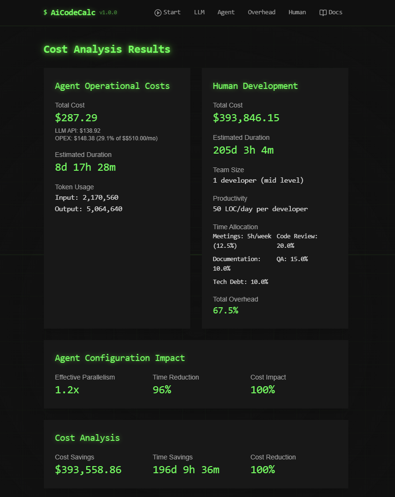

# AiCodeCalc - LLM Development Efficiency Calculator

AiCodeCalc is a sophisticated calculator designed to analyze and compare the costs and efficiency of LLM-powered development versus traditional human development. This tool helps organizations make data-driven decisions about implementing AI-assisted development workflows.



## Overview

AiCodeCalc provides detailed cost and efficiency analysis by considering multiple factors:

- Project complexity and scope
- LLM model configurations and costs
- Development overhead factors
- Human resource metrics
- Agent system configurations
- Operational expenses

## Key Benefits

- **Cost Analysis**: Compare direct costs between LLM-powered and human development
- **Efficiency Metrics**: Analyze time savings and productivity improvements
- **Resource Optimization**: Identify optimal configurations for LLM usage
- **Risk Assessment**: Evaluate overhead factors and potential bottlenecks
- **Team Planning**: Make informed decisions about resource allocation

## Features

- **Project Setup**
  - Lines of code estimation
  - Complexity assessment
  - Timeline planning

- **LLM Configuration**
  - Multiple model support
  - Usage share optimization
  - Cost tracking per 1K tokens

- **Human Metrics**
  - Team size and composition
  - Experience level consideration
  - Productivity metrics
  - Overhead time allocation

- **Agent Configuration**
  - Multiple operation modes (single, swarm, parallel)
  - Advanced memory management
  - Resource allocation strategies
  - Performance monitoring

- **Results Analysis**
  - Detailed cost breakdowns
  - Time comparisons
  - Token usage analytics
  - Efficiency metrics
  - OPEX calculations

## Installation

1. Clone the repository:
```bash
git clone https://github.com/ruvnet/AiCodeCalc.git
cd AiCodeCalc
```

2. Install dependencies:
```bash
npm install
# or
yarn install
# or
bun install
```

3. Start the development server:
```bash
npm run dev
# or
yarn dev
# or
bun dev
```

## Usage

1. **Project Setup**
   - Enter your project details including total lines of code and complexity
   - Specify project timeline and requirements

2. **Configure LLM Models**
   - Select and configure LLM models (default: GPT-4o 60%, GPT-4o-mini 40%)
   - Adjust usage shares and cost parameters

3. **Human Development Metrics**
   - Input team size and composition
   - Set productivity metrics and overhead factors

4. **Review Results**
   - Analyze cost comparisons
   - Review efficiency metrics
   - Export or share analysis results

## Technologies Used

- **Frontend Framework**: React with TypeScript
- **Build Tool**: Vite
- **UI Components**: shadcn/ui
- **Styling**: Tailwind CSS
- **State Management**: React Context
- **Deployment**: Fly.io

## Deployment

The application can be deployed using the included Dockerfile and deployment scripts:

```bash
# Build the Docker image
docker build -t aicalc .

# Deploy to fly.io
fly deploy
```

## Development

To contribute to the project:

1. Fork the repository
2. Create a feature branch
3. Make your changes
4. Submit a pull request

## License

[MIT License](LICENSE)

## Support

For support, please open an issue in the GitHub repository or contact the development team.
