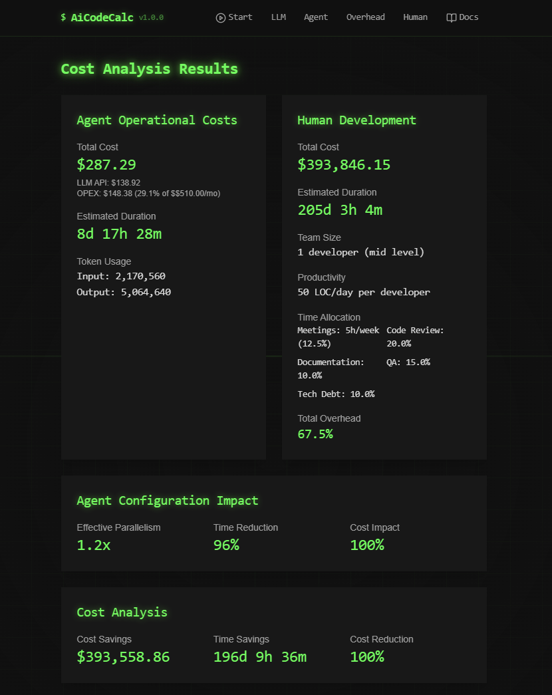

# 🚀 AiCodeCalc Documentation



## Transform Your Development Process with AI

AiCodeCalc is a sophisticated web-based calculator designed to estimate the financial and temporal costs associated with using Large Language Models (LLMs) for agent-based software development. Built with modern web technologies including Vite.js, React, and Tailwind CSS, it provides an intuitive dark-themed interface optimized for both desktop and mobile use.

The calculator features a cyberpunk-inspired design with real-time calculations, interactive visualizations, and comprehensive analytics. It helps organizations make data-driven decisions about AI implementation by:

- **Cost Analysis**: Calculate exact token usage, API costs, and operational expenses
- **Time Estimation**: Compare development timelines between traditional and AI-assisted approaches
- **Resource Planning**: Optimize allocation of both AI and human resources
- **Efficiency Metrics**: Track and analyze performance indicators and quality metrics

With support for multiple LLM models, advanced agent configurations, and detailed reporting, AiCodeCalc provides enterprise-grade analysis capabilities in an accessible web interface.

### 💡 Why AiCodeCalc?

#### Unlock Development Potential
- **3x Faster Development** through optimized AI agent collaboration
- **40% Cost Reduction** potential in suitable projects
- **24/7 Development Capacity** with AI agents
- **Seamless Human-AI Integration** for maximum efficiency

#### Smart Resource Optimization
- **Intelligent Model Selection** (GPT-4o & GPT-4o-mini)
- **Dynamic Resource Allocation**
- **Automated Cost Optimization**
- **Real-time Performance Analytics**

#### Enterprise-Grade Features
- **Advanced Agent Configurations**
  - Single Agent Mode for focused tasks
  - Parallel Processing for speed
  - Swarm Intelligence for complex projects
  - Concurrent Operations for flexibility

- **Comprehensive Analysis**
  - Detailed cost breakdowns
  - Efficiency metrics
  - Resource utilization
  - Quality indicators

## 🎯 Perfect For

### Technology Leaders
- Make informed decisions about AI adoption
- Optimize development resources
- Reduce operational costs
- Accelerate project delivery

### Development Teams
- Seamless AI integration
- Enhanced productivity
- Reduced repetitive work
- Better code quality

### Financial Planners
- Clear cost projections
- ROI analysis
- Resource optimization
- Budget planning

## 🌟 Key Features

### Intelligent Project Analysis
- **Smart LOC Estimation**
  - Pattern-based calculations
  - Complexity assessment
  - Accurate effort prediction

### Advanced LLM Integration
- **Dual Model Strategy**
  - GPT-4o (60%) for complex tasks
  - GPT-4o-mini (40%) for routine work
  - Optimized cost-performance ratio

### Powerful Agent Systems
- **Multiple Operation Modes**
  - Single Agent: Perfect for small projects
  - Parallel: Up to 5x throughput increase
  - Swarm: Complex problem solving
  - Concurrent: Balanced performance

### Smart Resource Management
- **Dynamic Allocation**
  - Automated scaling
  - Load balancing
  - Performance optimization

### Comprehensive Analytics
- **Real-time Insights**
  - Cost tracking
  - Efficiency metrics
  - Quality indicators
  - Resource utilization
 
## 🚀 Getting Started

### Quick Setup
```bash
git clone https://github.com/ruvnet/AiCodeCalc.git
cd AiCodeCalc
npm install
npm run dev
```

### Documentation Structure

#### Essential Guides
- [📚 Comprehensive Tutorial](TUTORIAL.md)
- [⚡ Quick Start Guide](QUICKSTART.md)
- [🏗️ Architecture Overview](ARCHITECTURE.md)
- [📊 Calculator Specification](CALCULATOR_SPECIFICATION.md)

#### Technical Details
- [🧩 Component Documentation](COMPONENTS.md)
- [🚀 Deployment Guide](DEPLOYMENT.md)
- [📋 Requirements Specification](REQUIREMENTS.md)
- [🎨 UI Specification](UI_SPECIFICATION.md)

## 🤝 Community & Support

### Join Our Community
- [GitHub Discussions](https://github.com/ruvnet/AiCodeCalc/discussions)
- [Issue Tracking](https://github.com/ruvnet/AiCodeCalc/issues)
- [Contributing Guidelines](TUTORIAL.md#contributing)

### Enterprise Support
- Custom integration assistance
- Dedicated support channels
- Training and workshops
- Optimization consulting

## 📈 Performance Metrics

### Development Speed
- Up to 300% faster development cycles
- 24/7 continuous development capability
- Reduced time-to-market

### Cost Efficiency
- 40-60% potential cost reduction
- Optimized resource utilization
- Reduced overhead costs

### Quality Improvements
- 90%+ code consistency
- Automated quality checks
- Standardized practices

## 🔒 Security & Compliance

- Enterprise-grade security
- Data privacy controls
- Compliance monitoring
- Audit trails

## 🌟 Start Transforming Your Development Today

Join the future of software development with AiCodeCalc. Make informed decisions, optimize resources, and accelerate your development process with advanced AI assistance.

[Get Started Now](QUICKSTART.md) | [View Documentation](TUTORIAL.md) | [Join Community](https://github.com/ruvnet/AiCodeCalc/discussions)

---

## License

AiCodeCalc is released under the MIT License. See [LICENSE](../LICENSE) for details.
